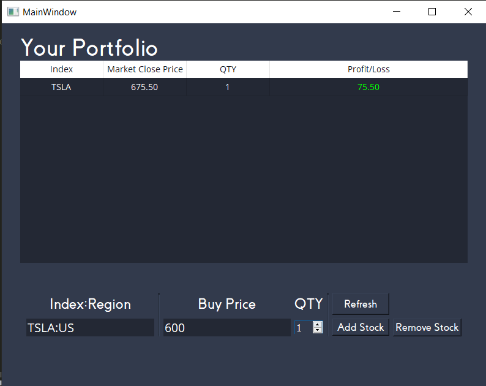

# Stock Profit Tracker

A Python GUI application that helps you keep track of the profit/loss of the stocks you buy. 

Powered by the Yahoo Finance API. Find it here: https://rapidapi.com/apidojo/api/yahoo-finance1

### Motivation
A one-stop application for all your stocks so that you do not have to keep jumping between different brokers and accounts to keep track of profits/losses

### How to use (installer)
1. Run the installer under releases
2. Replace API_KEY in .env_sample to your own api key for Yahoo Finance. 
3. Rename .env_sample to .env
4. Run app.exe
